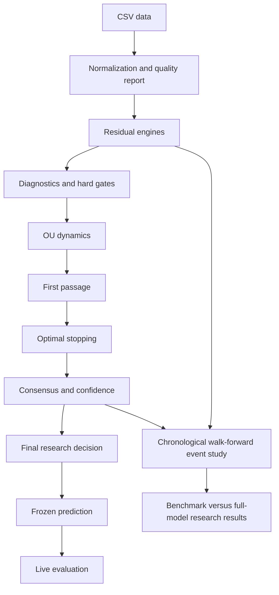

# Architecture

Data normalization outer-merges explicit repeated-pair mappings on observed dates without filling values. Residual engines own their model-specific state; diagnostics and hard gates decide whether downstream OU/stopping research is eligible. A `PredictionSnapshot` freezes all model-time outputs and a `PredictionEvaluation` records later observations separately. The walk-forward branch creates a signal from data through close *t* and executes it at close *t+1*.
