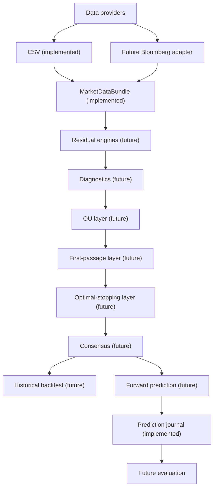

# Architecture

The implemented CSV provider yields a validated `MarketDataBundle` independent of future source adapters. The JSON prediction journal is deliberately separate from model logic: snapshot files capture information available at creation; later evaluation files never alter them.

Future residual engines can include rolling z-score, detrended log price, market/sector, static and dynamic pairs, PCA, cross-sectional, and basket approaches. OU is a downstream dynamics layer—not an independent equilibrium engine.

